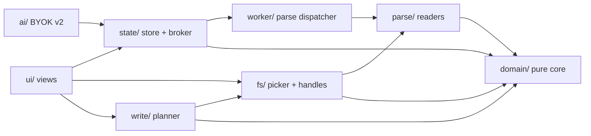

# Architecture Spine — PBI AI Prep

## Design Paradigm

**Hexagonal core over a source-anchored patch writer.** The product is one thing nothing else does: a byte-faithful write path into local Power BI TMDL/LSDL. That pins the paradigm — a pure domain core, the file formats and the browser filesystem as adapters, and a writer that patches the *original bytes* in place rather than re-serializing a model.

- `domain/` — pure core: model objects + source spans, the dependency ObjectGraph, the change journal, fidelity rules. Imports nothing from React, the DOM, or the File System Access API.
- `parse/` — read adapters: TMDL, LSDL, PBIR readers that emit domain objects **plus exact source byte spans**. Borrowed MIT parsers land here.
- `write/` — the patch engine (span patches, descending byte order) and the write planner (journal → per-file patches). The only thing that writes.
- `fs/` — File System Access adapter: picker, retained handles (persisted in IndexedDB), permission lifecycle, readwrite.
- `state/` — Zustand store + the worker broker: the single UI-facing projection over the domain.
- `ui/` — React views + bespoke Tailwind 4 design tokens.
- `worker/` — parse dispatcher: runs heavy deferred parses off the main thread.
- `ai/` — BYOK boundary, v2 only (stub).

The load-bearing consequence: **the write path is byte-faithful by construction, not by effort.** An edit-free save must be byte-identical (FR-23); unmodified spans are never touched and the writer never re-serializes.

## Invariants & Rules

### AD-1 — Hexagonal dependency rule

- **Binds:** all FRs · `domain/` and every adapter
- **Prevents:** format/FS logic leaking into the domain and making fidelity testable only in a live browser.
- **Rule:** `domain/` is a leaf — it imports nothing from `parse/`, `write/`, `fs/`, `state/`, `ui/`, `worker/`, or `ai/`. Adapters and the store import the domain; never the reverse. Nothing in `domain/` may reference `window`, `document`, or the File System Access API (enforce with `no-restricted-globals` + an import linter). The `worker/` imports `parse/` and `domain/` and never `state/` or `ui/`.

### AD-2 — Object identity is `lineageTag`, minted once

- **Binds:** FR-12 (rename), FR-14 (pending review), FR-17 (schema toggles), FR-30 (selection), FR-19/20 (canvas nodes)
- **Prevents:** three identity schemes drifting apart — selection by name, journal by path, graph by name — and double-keyed objects.
- **Rule:** every `ModelObject` has one stable id = its `lineageTag`; objects lacking one get a deterministic surrogate `file#byte-span`. Ids are minted **exactly once**, by the reader that produced the object, via a single shared span-derivation helper (span = half-open range of the full declaration block including annotations, excluding the doc comment; `file` = project-relative POSIX path). Report-layer visual endpoints are domain nodes with ids minted by the pbir-reader under the same rule. A rename is recorded as a change (FR-12) and **never** re-keys the id, so selection and prior pending changes survive it.

### AD-3 — Source-anchored byte patching; never re-serialize

- **Binds:** FR-22, FR-23, FR-33 (delete), SM-1 (edit-free fidelity), SM-2 (opens in Desktop)
- **Prevents:** loss of `ordinal`, `lineageTag`, `annotation`, `contentType: json`, formatting, and silent byte drift on an edit-free save.
- **Rule:** parse yields per-file `{ path, originalText, spans }`. A patch is a **half-open** `{ start, end }` over UTF-8 byte offsets into `originalText`; zero length = pure insertion. Readers record the declaration span, the doc-comment span, **and the name-token span** (required for rename). Replacement bytes are literal text — the empty string for a deletion — **never** content re-serialized from an AST. The write planner coalesces journal records per `{ objectId, field }` to a final value, so at most one patch targets any span and same-offset ties cannot arise; patches apply in descending byte order. The only sanctioned re-serialization is the enclosed LSDL JSON block, re-encoded within its own span. A re-serializing writer is a bug; the patch engine is the only writer.

### AD-4 — Change journal with owned fold and record stability

- **Binds:** FR-14 (pending review), FR-30/31 (selection + action bar), FR-33 (wave cascade)
- **Prevents:** in-place mutation losing the old value for review/discard, two mutation doors, and the grid/lineage/pending-modal reading divergent state.
- **Rule:** `journalAdd`/`journalDiscard` are the **only** mutation doors — store actions that wrap a pure domain fold; no component calls `setState` on journal or KPI fields directly. Records carry a stable `recordId` and are a discriminated union: `{ kind: 'field', objectId, field, old, new, file, context }` and `{ kind: 'delete', objectId, file, context, recordId }`. Field records **coalesce** on `{ objectId, field }` (re-edit replaces the record; `old` stays the pristine value). `file` = project-relative POSIX path; `context` = typed union. `project(model, journal)` is one pure fold in `domain/`; surfaces never fold it themselves. Wave-cascade deletions (FR-33) ride the same journal and are discarded by `journalDiscard`. Nothing writes until Save.

### AD-5 — Atomic, permission-aware, conflict-checked write with one post-save owner

- **Binds:** FR-22, FR-24 (save failure), FR-25 (external change), PRD §6.1
- **Prevents:** partial writes, silent overwrite of external edits, second-save false conflicts, and second-rename corruption from stale spans.
- **Rule:** Save path: group the journal by file → for each file, confirm the on-disk content still equals that file's **current** snapshot (fresh after the last save; else block and offer reload-or-overwrite, naming it — FR-25) → apply patches descending → write via `createWritable` (atomic replace) → report the files written. A revoked permission stops the save, reports every file already written, retains the whole journal, and offers a user-gesture retry (FR-24). **Post-save has exactly one owner:** the orchestrator commits, per written file, `originalText ← written bytes`, shifts that file's stored spans by the applied patch deltas, and marks touched lazy layers' `parseState = stale` (re-parse on next request).

### AD-6 — One ObjectGraph over the pristine model; one shared resolver

- **Binds:** FR-9 (Used count), FR-20 (impact trace), FR-33 (blast radius), FR-37 (Lineage KPIs)
- **Prevents:** the grid's Used pill and the canvas side panel disagreeing on counts.
- **Rule:** a single pure engine over fixed edge kinds — visual→object, measure→object, calcObject→source, calcItem→DAX reference, fieldParam→NAMEOF column, function→body reference, table→table relationship; **visual→visual excluded**. The graph is built from the **pristine parsed model**; journal records never alter edges. Nodes key on object id; all edge feeders resolve names→ids through **one** shared domain resolver (no per-feeder mapping) — report-layer visual endpoints resolve through the same resolver; an unresolved reference is a broken reference attributed to its visual. Wave-cascade deletion is a **derived subgraph view** (canonical graph minus the removed objects), never a mutation of the canonical graph. Model edges build during the lineage parse stage (FR-35) and are memoized; report edges overlay lazily. Add an edge kind; never add a second graph.

### AD-7 — Eager model parse, lazy heavy parse, off the main thread

- **Binds:** FR-5, FR-7 (usage unavailable vs zero), FR-8 (5s / 50ms budget), FR-35 (parse stepper)
- **Prevents:** eager LSDL parse blowing the 5s budget at 2,000 objects, the grid depending on report data, and duplicate 2,000-object parses.
- **Rule:** on folder open, parse the definition tree into model objects within the 5s budget. LSDL, the report layer, and report-edge lineage parse lazily on first need (Prep for AI tabs, Lineage tab, usage columns). Heavy parses run in the worker (store → worker → parse → domain); the worker returns plain domain data over `postMessage` and **never imports `state/`**; a main-thread broker inside `state/` is the only commit path. Layer output lives at `state.layers[<layer>] = { parseState, data }`; `parseState` is status-only `idle | parsing | ready | error | stale`; layer requests are idempotent (at most one in-flight parse per layer; later subscribers await the same promise). The main thread never blocks >50ms. **This decides PRD §11.6 / the addendum's measure-first guidance in favour of building the worker now.**

### AD-8 — Report-layer and LSDL writes are scoped and enumerated

- **Binds:** FR-12, FR-15, FR-16, FR-17, FR-18, PRD §6.1
- **Prevents:** non-rename writes damaging report visuals, and the LSDL binding silently drifting from a renamed object.
- **Rule:** the report layer is written **only** for rename propagation of field bindings. LSDL writes are limited to exactly: `CustomInstructions` (FR-15), entity `Terms` incl. `Deleted` tombstoning (FR-16), entity `Visibility` with state `Authored` (FR-17), and the rename re-key of the entity binding (FR-12) — all through the same patch engine (AD-3); verified answers read-only (FR-18). The lsdl-reader owns a **binding index** (`objectId → { file, span, state }`) rebuilt on every LSDL parse and stored with the LSDL layer; rename planning reads the index only — **never text search** — and folds the journal to the final name first.

### AD-9 — Encoding, layout, and caps are not optional

- **Binds:** FR-15 (10k cap), FR-16 (synonyms + 20-cap), FR-22, FR-23, SM-1
- **Prevents:** a writer emitting LF, BOM, or `//` and breaking Power BI bindings or inflating the diff.
- **Rule:** UTF-8 without BOM; preserve each file's original line endings (CRLF preserved); TMDL tab indentation; `///` doc comments (never `//`); LSDL state enum values written verbatim (User, Generated, Suggested, Deleted, Authored); doc comments at the declaration's indentation. Field descriptions capped at 500 decoded chars with the 200-char Copilot cutoff marked; LSDL `CustomInstructions` capped at 10,000 decoded chars; **a field holds at most 20 live synonyms**. Until Open Question 6 is verified, LSDL writes preserve `Agents` timestamps verbatim.

### AD-10 — Single store owns all cross-surface state

- **Binds:** FR-14 (pending survives tab nav), FR-30 (selection survives filter/page), FR-31 (action bar), FR-34 (disabled-never-hidden), FR-37/38 (KPI + sub-tabs)
- **Prevents:** selection/journal/filter state fragmenting across grid, lineage, and action bar, each keeping its own copy.
- **Rule:** one Zustand store owns the loaded project (parse result + spans + original texts), the change journal, selection, filter/sort/pagination, per-layer `parseState`, KPI counts, and the **permission state**. **Selection is `selectedIds: string[]`** (ordered, unique, keyed by `lineageTag`); canvas selection is a one-element instance of the same shape. Controls render "disabled, never hidden" with an explanation when the current permission does not allow the action (FR-34). Component-local state holds only non-shared display (modal open, hover, a local draft). Two builders — grid and lineage — must never each keep their own copy of selection or pending changes.

### AD-11 — Accessibility and keyboard-first are binding invariants

- **Binds:** FR-11 (keyboard editing), NFR accessibility, PRD §5
- **Prevents:** the grid builder and the modal/lineage builder diverging on keyboard and aria behaviour.
- **Rule:** WCAG 2.1 AA across the app. The grid is fully keyboard-operable (Tab/Shift+Tab traverse cells, Enter commits-and-moves-down, Escape reverts/closes); focus management and restore are binding; tabs carry `role="tab"` + `aria-selected` + roving tabindex; modals trap and restore focus; tooltip triggers are focusable.

### Dependency direction (a rule, not a picture)



Arrows point along the dependency gradient. `domain/` is a leaf — no outgoing edge. `parse/` and `write/` depend on `fs/` for I/O (readers read bytes; the planner drives `createWritable`); `fs/` is an I/O leaf. `worker/` imports `parse/` and `domain/`, never `state/` or `ui/`, and the store owns the worker, receiving results through `parseState` (AD-7). Only `ui/` and `ai/` reach into `state/`.

## Consistency Conventions

| Concern | Convention |
| --- | --- |
| Naming | Object type enum: table, column, calculatedColumn, measure, hierarchy, hierarchyLevel, calculationGroup, calculationItem, fieldParameter, daxFunction. A calculated table is type `table` (calculated partition) — no separate `calculatedTable` type. LSDL state enum quoted verbatim (User/Generated/Suggested/Deleted/Authored). Files: `*-reader.ts` in `parse/`, `patch-engine.ts`/`write-planner.ts` in `write/`. |
| Data & formats | Error shape `{ file, value, expected }` everywhere (failure legibility NFR). Ids = `lineageTag` (or `file#byte-span` surrogate), minted once. Dates ISO-8601. Encoding UTF-8 without BOM; line endings preserved. LSDL JSON lives in the triple-backtick `linguisticMetadata` block, `contentType: json` line untouched. |
| State & cross-cutting | Mutation only via the journal (AD-4). Cross-surface state only in the store (AD-10); selection is `selectedIds: string[]`. Deferred parse states at `state.layers[<layer>]`. Theme in `localStorage 'theme'` (FR-36); never `prefers-color-scheme`. Zero server — no telemetry, no analytics, no outbound traffic except BYOK calls the user triggers (PRD §5). |
| Performance | Grid AND pending-changes list virtualise at 2,000 rows with no frame over 16ms; filter resolves within 200ms; main thread never blocks over 50ms; folder→grid within 5s. Virtualisation is a binding floor, not a library preference. |
| Verification | Two automated gates ship with the core and run headless in Node (made browser-free by AD-1): (1) edit-free-save fidelity — open the reference model, save unmodified, assert byte-identical (FR-23, SM-1); (2) the synthetic edge-case fixture's expected Used counts fail the build on mismatch (PRD §5). |
| Format boundaries | TMDL parsing must not depend on report data; report parsing must not depend on LSDL. Reused MIT parsers are adapted under `parse/`, must emit spans (AD-3), and keep their LICENSE files and README attribution. |

## Stack

**SEED — verified current at authoring (2026-08-30); the code owns these once it exists.**

| Name | Version |
| --- | --- |
| React | 19.2.8 — supersedes the addendum/EXPERIENCE "React 18" pin (doc drift; peer-compatible with the borrowed Lineage Tracer components: zustand peers react>=18, @xyflow/react peers react>=17); offer to reconcile those two sources |
| Vite | 8.2.2 (Rolldown bundler) |
| Tailwind CSS | 4.3.3 (CSS-first `@theme`, no `tailwind.config.js`) |
| Zustand | 5.0.15 |
| @xyflow/react | 12.11.5 |
| elkjs | 0.12.0 |
| lucide-react | latest (icons) |
| TypeScript | ~6.0 (create-vite scaffold default; latest stable is 7.x — pick at kickoff) |
| Hosting | GitHub Pages (static, HTTPS — secure context for File System Access API; serves from the project subpath, so Vite `base` is relative: `base: './'`) |

## Structural Seed

```text
src/
  domain/       # pure core: ModelObject + spans, ObjectGraph, EditSession/journal, fidelity rules, name->id resolver, surrogate helper
  parse/        # read adapters: tmdl-reader, lsdl-reader (owns LSDL binding index), pbir-reader, source-span emitter
  write/        # patch-engine (half-open span patches, descending order), write-planner (journal -> per-file patches, post-save refresh)
  fs/           # File System Access adapter: picker, retained handles (persisted in IndexedDB — handles survive only structured-clone stores), permission, readwrite
  state/        # Zustand store + worker broker: project, journal, selectedIds, filters, layers[<layer>]
  ui/           # React views: grid, lineage canvas, prep-for-ai, chrome; design tokens
  ai/           # BYOK boundary (v2; stub only)
  worker/       # parse dispatcher: deferred LSDL / report / report-edge lineage parse (never imports state/)
```

**Operational envelope:** a static client-side SPA on GitHub Pages — no backend, no API routes, no database, no telemetry. The only environment is the public HTTPS site, served from the project subpath (`/pbi-ai-prep/`), so Vite `base` is relative and deploy is GitHub Actions (`npm ci` → `vite build` → Pages). Secure context is required for the File System Access API. Authoring requires a Chromium desktop browser, v86+, with a keyboard and a local filesystem.

## Capability → Architecture Map

| Capability / Area | Lives in | Governed by |
| --- | --- | --- |
| Project Open & Discovery (FR-1..4) | `fs/` + `ui/landing` + `state/` | AD-5, AD-7 |
| Model Parsing (FR-5..8) | `parse/` + `worker/` | AD-3, AD-6, AD-7 |
| Object Grid & Metadata Editing (FR-9..14) | `ui/grid` + `state/` | AD-2, AD-4, AD-6, AD-10, AD-11 |
| Prep for AI (FR-15..18, FR-38) | `parse/lsdl` + `ui/prep` + `write/` | AD-6, AD-8, AD-9, AD-7 |
| Relationships Canvas (FR-19..21) | `ui/lineage` + `domain/Graph` | AD-2, AD-6, AD-10, AD-11 |
| Saving to Disk (FR-22..25) | `write/` + `fs/` | AD-3, AD-5, AD-8 |
| Grid Interactions at Scale (FR-30..33) | `state/` + `ui/action-bar` + `write/` | AD-2, AD-4, AD-6, AD-5, AD-10 |
| First-Run & Chrome (FR-34..38) | `ui/` + `state/` | AD-7, AD-10, AD-11 |

## Deferred

- **Grid library choice** (PRD §11.5). The data-grid library is a UI concern; the `domain/` + `state/` boundary keeps it swappable. Virtualisation at 2,000 rows with inline edit and full keyboard nav is a **binding floor** (see Conventions), not the library's choice to decide.
- **BYOK / AI drafting (FR-26..29).** Deferred to v2 by user decision. The `ai/` boundary is drawn so it lands without touching `domain/` or `write/`.
- **Diff preview, offline review round-trip, template library & house-style enforcement** — v2, per PRD §9.2. Note: bulk Set-description with inline `{Table}`/`{Name}` token substitution ships in v1 (FR-31); what is deferred is the template feature, not the tokens.
- **DAX reference rewriting on rename** — warning only in v1 (FR-12).
- **Translation cultures beyond the primary** — v2; the LSDL machinery generalises but the UI does not.
- **The operational envelope beyond GitHub Pages** — no infra to decide; nothing to add until the deployment target changes.

## Open Questions

Verified against the fixture / Power BI Desktop before the corresponding write ships; these are facts, not decisions — the spine does not guess them.

1. Does renaming emit `changedProperty = Name`? (PRD §11.1) — resolve by renaming in Desktop and diffing the TMDL.
2. Can a culture file be created from nothing if the model never had Q&A enabled, or must Power BI author it first? (PRD §11.3)
3. Is `State: Deleted` the correct tombstone for a removed generated synonym, and does Power BI honour it? (PRD §11.4)
4. Does the appended `PBIPreAI_RemoveUnusedCols` M step survive Power BI Desktop's step consolidation when a user later edits the query? (PRD §11.7)
5. Does a Web Worker (AD-7) suffice for the 2,000-object LSDL/report/lineage parse, or is a more aggressive chunked/streaming split needed? — AD-7 decides to build it; the sufficiency question remains, measured against the fixture before ship (PRD §11.6).
6. Do LSDL `Agents` timestamps need updating when the tool writes the blob, and does stale metadata cause Power BI to regenerate synonyms? (PRD §11.2) — until verified, LSDL writes preserve `Agents` timestamps verbatim.
